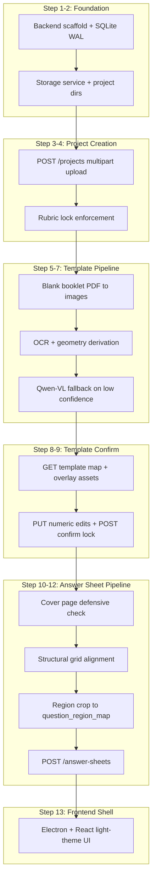

# RubricEye Phase 1 — Core Infrastructure Plan

## Scope Boundary

Phase 1 delivers: **create project → derive/confirm template map → upload answer sheets → convert/align/segment into `question_region_map`**. Grading (`POST .../grade`), `QuestionBankItem` population, `QuestionGroup`, ink-density pre-filter, and examiner confirmation are **Phase 2** — do not wire them in.

**Approved deviation from roadmap:** you chose to **stub `QuestionBankItem`** in Phase 1 (schema + empty table only; rows populated when grading is integrated in Phase 2). The roadmap checklist item for extraction at `POST /projects` is deferred accordingly — we still store rubric/question-paper PDFs and lock the rubric.

---

## Proposed File Structure

```
RubricEye/
├── backend/
│   ├── requirements.txt
│   └── app/
│       ├── main.py                    # FastAPI app, CORS for Electron
│       ├── config.py                  # DATA_DIR, DPI, paths
│       ├── db/
│       │   ├── database.py            # SQLite engine, WAL pragma
│       │   ├── models.py              # SQLAlchemy: Project, TemplateMapPage,
│       │   │                          #   AnswerSheet, QuestionBankItem (empty)
│       │   └── init_db.py
│       ├── schemas/                   # Pydantic request/response models
│       ├── routes/
│       │   ├── projects.py            # POST/GET /projects, rubric-lock guard
│       │   ├── template_map.py        # GET candidate map, PUT edits, POST confirm
│       │   └── answer_sheets.py       # POST upload, GET list/detail
│       └── services/
│           ├── storage.py             # atomic write (tmp + rename), dir layout
│           ├── pdf_pipeline.py        # pdf_to_ordered_images (TechDoc §4)
│           ├── template_derivation.py # OCR + geometry first pass
│           ├── template_vision_fallback.py  # Qwen-VL structural read (fallback only)
│           ├── alignment.py           # structural-grid homography per scan
│           ├── segmentation.py        # Template map → question_region_map
│           └── cover_page_check.py    # defensive bubble-grid/signature reject
├── frontend/
│   ├── package.json
│   ├── electron/
│   │   └── main.js                    # spawn FastAPI child, load React
│   └── src/
│       ├── App.tsx
│       ├── api/client.ts              # fetch wrapper → localhost backend
│       ├── pages/
│       │   ├── ProjectList.tsx
│       │   ├── CreateProject.tsx
│       │   ├── ProjectDetail.tsx
│       │   ├── TemplateMapReview.tsx  # overlay + numeric region table
│       │   └── UploadAnswerSheet.tsx
│       └── components/
│           ├── RegionOverlay.tsx      # canvas/SVG bbox preview (read + numeric sync)
│           └── RegionEditorTable.tsx  # editable question_number + bbox rows
├── DOCS/                              # existing specs (unchanged)
└── README.md
```

**Runtime data** (gitignored, per [RubricEye_TechDoc.md](DOCS/RubricEye_TechDoc.md) §3):

```
~/rubriceye_data/          # or platform app-data dir via config
  rubriceye.db             # authoritative name (not nationalmark.db from Architecture doc)
  projects/{project_id}/
    rubric.pdf
    question_paper.pdf
    blank_booklet.pdf      # missing from TechDoc §3 layout — add explicitly
    template_map.json      # locked after confirm (derived + user edits)
    alignment_reference.json
    answer_sheets/{answer_sheet_id}/
      original.pdf
      page_001.png ...
```

---

## Build Order (Components)




### Step 1 — Backend scaffold

- FastAPI app with health check, CORS for `http://localhost:*` (Electron).
- SQLite with `PRAGMA journal_mode=WAL` on connect ([TechDoc §6](DOCS/RubricEye_TechDoc.md)).
- SQLAlchemy models matching [TechDoc §2](DOCS/RubricEye_TechDoc.md): `Project`, `AnswerSheet`, `TemplateMapPage` (normalized from the nested TemplateMap spec), `QuestionBankItem` (table exists, no rows yet).
- Key fields: `Project.template_map_confirmed`, `Project.rubric_locked=True` at insert, `AnswerSheet.question_region_map` JSON, `AnswerSheet.roll_number`.

### Step 2 — Storage service

- Resolve `DATA_DIR` (env override or OS app-data path).
- Atomic writes: write to `{path}.tmp` then `os.replace`.
- Create per-project directory tree on project creation.

### Step 3 — `POST /projects`

- Multipart: `name`, `rubric` (PDF), `question_paper` (PDF), `blank_booklet` (PDF).
- Save three PDFs, insert project row with `rubric_locked=True`.
- **Reject** any PATCH/PUT on rubric paths (404 or 403 — no update route exists).
- Trigger async-or-sync template derivation job; return project + `template_map_status: "pending"`.
- Supporting routes: `GET /projects`, `GET /projects/{id}`.

### Step 4 — PDF → ordered images

- Implement [TechDoc §4](DOCS/RubricEye_TechDoc.md) verbatim (`fitz`, 200 DPI, `page_{i+1:03d}.png`).
- Used for blank booklet (derivation) and answer sheets (upload).

### Step 5 — Template map derivation (board-agnostic)

- **First pass (zero cost):** PyMuPDF render + **Tesseract OCR** for printed question labels/headers + **OpenCV** line/box detection (ruled lines, rectangular answer boxes). Output candidate regions: `{question_number, part_label, bbox}` per page in blank-booklet coordinates.
- Persist `alignment_reference` (detected horizontal/vertical line grid, corner anchors) alongside regions — used later for scan alignment, not board-specific fiducials ([Architecture §2.1](DOCS/RubricEye_Architecture.md)).
- **Confidence scoring:** flag derivation as `low_confidence` if fewer than expected regions detected, OCR confidence below threshold, or irregular/non-grid layout.
- **Fallback:** call Qwen-VL-Max with blank booklet page images + a structural-extraction prompt (distinct from grading `SYSTEM_PROMPT` in [mini_grader.py](DOCS/mini_grader.py)) to propose region bboxes. Requires `DASHSCOPE_API_KEY` even in Phase 1 for irregular booklets.

### Step 6 — Template review + confirm (numeric edit)

Per your choice: **no drag-resize canvas editing in Phase 1**.

- `GET /projects/{id}/template-map` — returns page images + region list + overlay preview URLs.
- `PUT /projects/{id}/template-map` — accepts edited rows: `{page_number, question_number, part_label, bbox: [x1,y1,x2,y2]}`; validates bounds, stores as candidate (not locked).
- `RegionOverlay` component renders bboxes from table values (visual feedback only; edits happen in `RegionEditorTable`).
- `POST /projects/{id}/template-map/confirm` — sets `template_map_confirmed=True`, writes locked `template_map.json`. **Block answer-sheet upload until confirmed** ([TechDoc §10 step 2](DOCS/RubricEye_TechDoc.md)).

### Step 7 — Cover-page defensive check

- On answer-sheet upload, inspect page 1 for bubble-grid/signature layout heuristics (high-density circular contours + grid regularity, or OCR hits on "signature"/"roll no" header patterns).
- Match → **reject upload** with explicit error; do not silently process ([Architecture §5.1](DOCS/RubricEye_Architecture.md)).
- Default assumption: identity page already removed pre-scan; this is backstop only.

### Step 8 — Structural alignment + segmentation

- Convert uploaded answer PDF to ordered page images.
- Align each page to blank-booklet structural grid via detected line homography (same line-detection approach as derivation, applied to filled scans).
- Apply confirmed template map bboxes (transformed by alignment) → build `question_region_map: {question_number: [{page_index, bbox}]}` ([TechDoc §2 AnswerSheet](DOCS/RubricEye_TechDoc.md)).
- Store cropped region previews on disk (optional, useful for Phase 2 UI/debug) under `answer_sheets/{id}/regions/`.

### Step 9 — `POST /projects/{id}/answer-sheets`

- Requires `template_map_confirmed=True`.
- Fields: PDF file + `**roll_number` (user-entered string)** — not auto-OCR'd in Phase 1 (aligns with board practice, avoids sending identity regions to any parser).
- Pipeline: cover check → PDF convert → align → segment → persist `AnswerSheet` row.
- `GET /projects/{id}/answer-sheets`, `GET /projects/{id}/answer-sheets/{id}` for UI verification (show page thumbnails + per-question region summary).

### Step 10 — Frontend shell (light theme)

- Electron main process starts FastAPI subprocess, opens React window.
- Pages: project list → create project (4-file upload) → project detail (status: template pending/confirmed) → template review (overlay + numeric table + confirm) → upload answer sheet (roll number + PDF) → view segmentation summary.
- No grade button, no results viewer, no auto-approve path.

---

## API Surface (Phase 1 Only)


| Method   | Route                                 | Purpose                         |
| -------- | ------------------------------------- | ------------------------------- |
| GET      | `/health`                             | Backend alive                   |
| GET/POST | `/projects`                           | List / create                   |
| GET      | `/projects/{id}`                      | Detail + template status        |
| GET      | `/projects/{id}/template-map`         | Candidate regions + page images |
| PUT      | `/projects/{id}/template-map`         | Numeric region edits            |
| POST     | `/projects/{id}/template-map/confirm` | Lock map                        |
| GET/POST | `/projects/{id}/answer-sheets`        | List / upload                   |
| GET      | `/projects/{id}/answer-sheets/{id}`   | Segmentation result             |


**Explicitly absent in Phase 1:** `POST .../grade`, `POST .../confirm` (human score), any rubric update route.

---

## Dependencies (Initial)

**Backend:** `fastapi`, `uvicorn`, `sqlalchemy`, `pymupdf`, `python-multipart`, `opencv-python-headless`, `pytesseract`, `numpy`, `openai` (Qwen fallback only), `pydantic-settings`

**Frontend:** `electron`, `react`, `react-router-dom`, `vite`, `typescript` (or JS if you prefer parity with SyncriptenLearn — defaulting to TypeScript for API typing)

**System:** Tesseract OCR binary (document in README; required for template derivation first pass)

---

## Ambiguities Resolved / Flagged


| Item                                            | Resolution                                                                                               |
| ----------------------------------------------- | -------------------------------------------------------------------------------------------------------- |
| QuestionBankItem extraction at project creation | **Deferred to Phase 2** (your choice). Phase 1 creates table, stores PDFs only.                          |
| Template map editing UX                         | **Numeric table edit** (your choice). Overlay is preview-only.                                           |
| DB filename                                     | Use `**rubriceye.db**` ([TechDoc](DOCS/RubricEye_TechDoc.md) wins over Architecture's `nationalmark.db`) |
| Blank booklet in file layout                    | Add `blank_booklet.pdf` to project dir (omitted in TechDoc §3)                                           |
| Roll number                                     | **Manual entry at upload** (recommended default; not specified in docs)                                  |
| Rubric file format                              | **PDF only** for Phase 1 (matches all doc examples and PyMuPDF pipeline)                                 |
| Qwen-VL in Phase 1                              | **Yes** — roadmap includes vision fallback for irregular blank booklets; separate prompt from grading    |
| QuestionGroup / first-N logic                   | **Phase 2** — segmentation in Phase 1 maps all detected regions; choice filtering comes with grading     |
| SyncriptenLearn reuse                           | No existing code in this repo; scaffold fresh Electron+React matching README stack                       |


**Remaining assumption to validate during build:** structural-grid alignment via line-based homography will generalize across your test booklets. If alignment fails on a real scan, we tune detection parameters — not hardcode board layouts.

---

## Phase 1 Done Criteria

Manual verification with a real blank booklet + filled answer scan:

1. Create project → rubric locked (API rejects rubric edit attempts).
2. Template map derived → user edits bboxes numerically → confirms → `template_map_confirmed=True`.
3. Upload answer sheet with roll number → pages converted in order → cover-page-like upload rejected.
4. `question_region_map` populated with sensible per-question bboxes across pages.
5. Restart app → all project data intact (SQLite WAL + atomic files).
6. No outbound AI calls except template-derivation fallback on low-confidence booklets; **no grading calls**.

